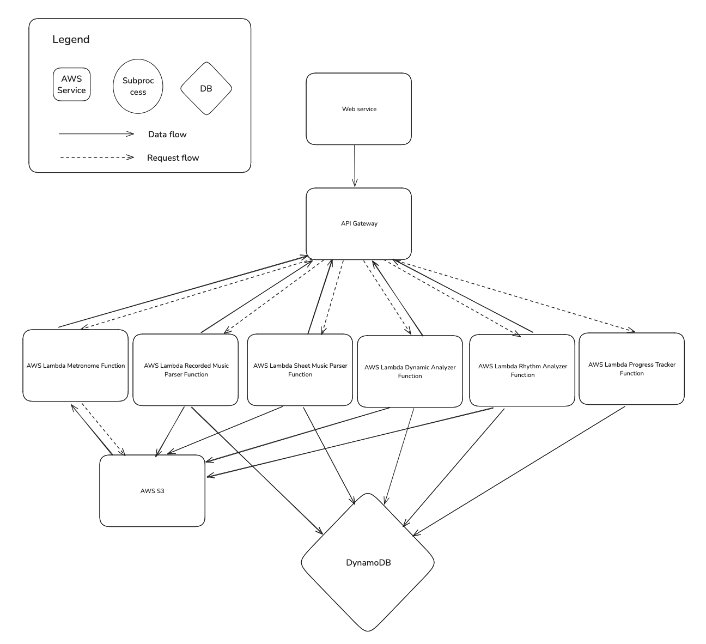
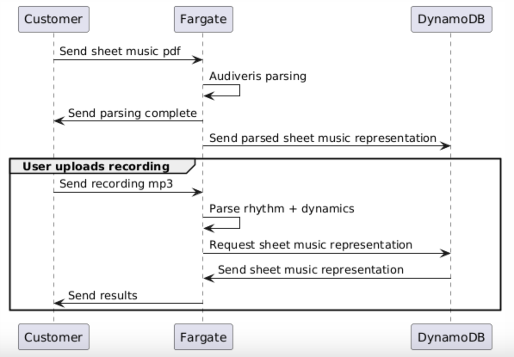
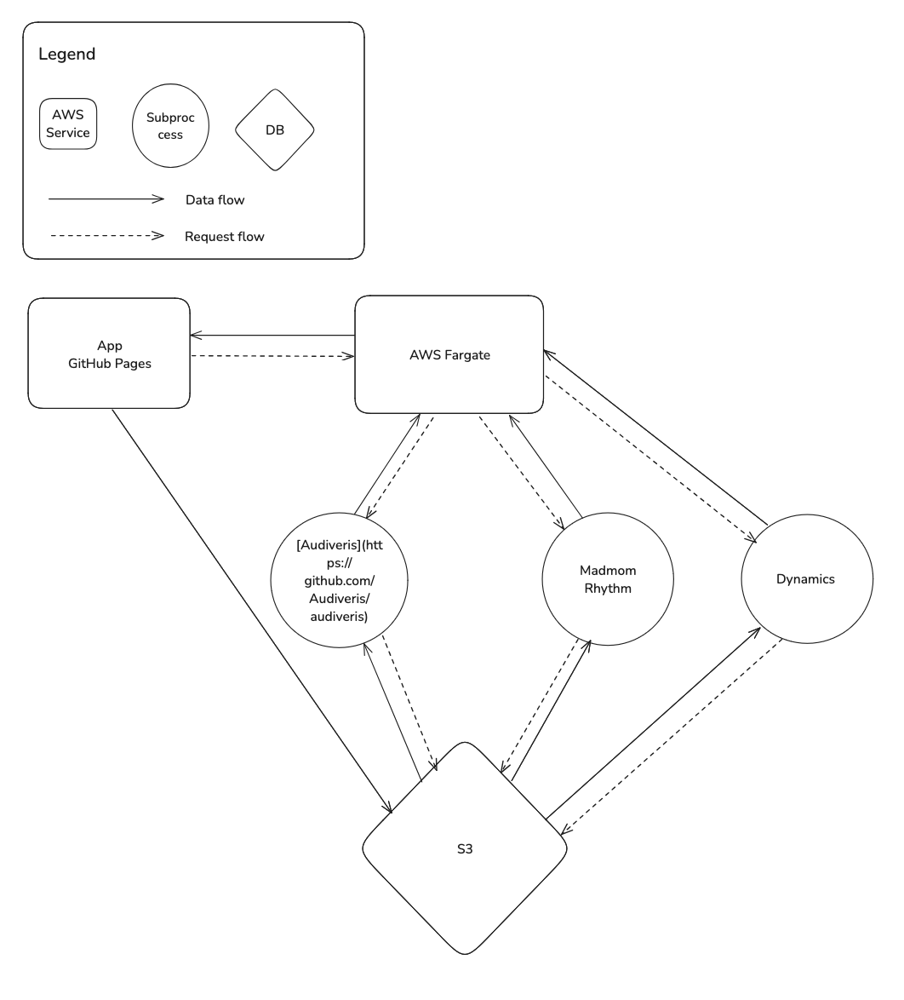
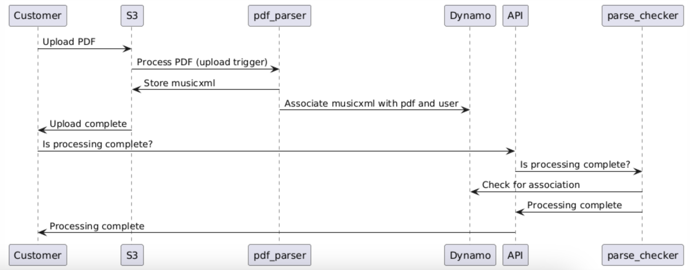

# Backend Documentation

### Document Owners

Justin, Irena, Ricky

### Document Status

As of 11/6, Draft

# Background

Traditional music lessons are expensive, impose scheduling constraints, and can be a source of stress for students. Many beginner music students lack accessible & affordable options for individual or personalized feedback outside of traditional music lessons, thus limiting their ability to learn and practice music effectively. We aim to address this issue by creating a no-cost, risk free system to provide feedback on practice session effectiveness. Our goal is that this tool can be used as a way for music learners to improve independently without replacing the role of music teachers.
This document will outline the backend design for the MusicNU system. Intended outcomes from this document should be a clear set of architectures and functions necessary to fulfill the [frontend design](https://drive.google.com/file/d/1bXY5QJPmPokZy4K34h-OvXNuVt6TgE2r/view?usp=sharing) and [mockups](https://www.figma.com/design/upaNscJzT86D3SswN08mY4/Mockups?node-id=0-1&t=Rp3g5AaWQEDzXuzo-1). Reviewers should focus on the requirements and serverless design in this first review session.

# Requirements

## Functional Requirements

As a piano learner, given that I want to learn how to distinguish dynamics, I need the system to tell me when I am playing too loud/soft.

As a piano learner, given that I want to learn multiple songs, I need the system to process different songs.

As a piano learner, given that I want to keep practicing songs over a period of time, I need the system to save my uploaded files and progress

As a piano learner, given that I want to know where I need to improve, I need a system to tell me which sections of the piece I should work on more

As a piano learner, given that I want to practice my rhythm, I want there to be a metronome toggle feature so I can play on-beat

## Nonfunctional Requirements

The system should cost under $200 per month

- This requirement is calculated by the total value of a CS microgrant ($200), which we can submit as many times as needed. We have 4 team members, each of whom can submit a microgrant proposal for the project. Spending under $200 a month means an individual team member will never submit more than one proposal per quarter.

The system should process a recording in X seconds

- X will be determined through user testing

The system should process sheet music in X seconds

- X will be determined through user testing

# Feature List

- P0: This feature is a must-have. The MVP cannot be complete until all P0 features are implemented.
- P1: This feature is a need-to-have. These are features that we need to implement after the MVP is released, but will not block release.
- P2: This feature is a nice-to-have. These can be completed as time permits after the product is released.

The project cannot be marked complete until all P0 and P1 features are implemented.

| Priority Level | Feature Details                  | ECD      | PR Link | Owner  |
| -------------- | -------------------------------- | -------- | ------- | ------ |
| P0             | AWS Architecture                 | 11/26/24 | TBD     | Justin |
| P0             | Sheet music parser               | TBD      | TBD     | Irena  |
| P0             | Rhythm target from sheet music   | TBD      | TBD     | Justin |
| P0             | Dynamics target from sheet music | TBD      | TBD     | -----  |
| P1             | Progress saving                  | TBD      | TBD     | —      |
| P2             | Metronome                        | TBD      | TBD     | -----  |

# System Design

## Serverless (Recommended)

Serverless Design [PlantUML Diagram](https://www.plantuml.com/plantuml/uml/bP9DReCm48Ntd68kq1MxBAf4ZIfr4SaAxJfoOKgi-CVrZDNIqnUJ85CKaBg98lW--yqyjiGoS3IwQ8EB7iJ-6RmCf6nRF4LYPp30moDKvGRUl7QoIKXHbUdX26pWY1o37UptM5-GuO8TIDk0Rpx-7BGJBmd_Z4WCxC07LoFHH2jw996zUKfHqlclGRKj1d1s2egU43qnHim7vuoPcQQyerRi0eA9fEflesV0lhFIk0tiY5oj96SGlXIVvqF7NiidvBd5C6nQBjJEU8sCuxHvb_SWj4rnQ-YGBWQntj51b0iTfLV_wiZdE04fQgOXyhWKLP-EvuxFvhIpKdS_6EwfnG8xxos5YqcOrboLgxVbkPPkMTLl_rRzwITo5KWH7A_hMBFI9iU0Ss_U_38urB_jVwBHlm00)

Pros:

- Cost effective: only pay for compute time when actively in use
- Ease of deployment: can be deployed and updated independently

Cons:

- Cold start latency: delays when triggered after long period of inactivity
- Execution time limits: tasks with long processing times need to be executed within 15 minutes
  - Before acceptance, we must
    - Test processing on 10 minute audio files
    - Test processing on multi page PDFs

Files will be stored in S3 for 5 years. Since we are not expecting much traffic on the website during development, this should not pose a cost issue.

Lambda logs will be stored in a cloudwatch metrics store. Cloudwatch was chosen because it is easily configured and added to Lambda functions.

When the Lambda function fails, an error message will be returned to the client depending on what error occurred (malformed pdf, server error, etc.). The client will be responsible for retrying where appropriate. Lambda failures will be recorded in the cloudwatch metrics store.

## Serverful

Serverful Design [PlantUML Diagram](https://www.plantuml.com/plantuml/uml/VP7DIiGm58NtzodkNbovSo6Z3gv5yG52Ssm3pO_tHvYtjqKh7GXT9P0lDzyvEQa5CSypFRjQpH2-VU2N86CmtFCxIcIT0EFicWPkyPF-Jg_0Hu_f6vAKMn1DPTnJs-ZVUHl1GyrjXc6FdYybv7f-sg6uDX0qWQ9Oi5GBqIZL6tyeXBtDDKHbmL0bhX87gVuXpkskc-brVPnbkjYK-ORZgfO6xUk-uSkXTgIwmVs6-vSEQbmedqrfsHFHQLcMR_m1)

Pros

- Processing is fast
- Can parse functionally infinite size PDFs

Cons

- More expensive
- Harder to write in multiple languages - audiveris is Java

## Asynchronous (Not Recommended)

Asynchronous [PlantUML Diagram](https://www.plantuml.com/plantuml/uml/TS-nJWCn383X_Px28mnCtMw0LgsGkfrqOgwYnBr6975aEmBUdePhMahfQdzo_Yn53Mk9eLiNKOh8yFGCuwA7jnp8E1WshzsugCFizhjiM91x69WiYjGjF9HPAljfGdxi6hpS6fKO8HRnzZE6Fs3pbKoa7bOYPBtH2uGFhuVwBfZae1pzAQMrdYijnHnGyUeNgs7RmrOWpx4-JMVtqXsNrVnaxEm1xJloVNt5VaUlwmZsn61E-PxI3PzJXjlBBQDb_u-Mc5o9uHi0)

Pros:

- Directly upload to S3 from frontend
- Doesn’t hang client after upload

Cons:

- More complex architecture
  - Additional API + Lambda for parser_checker
  - Additional job status updates in Dynamo for PDFs and recordings
- More API requests

The complexity of implementing asynchronous design would outweigh the minor pros they come with. In addition, implementing asynchronous design through either polling or websockets would require this increased complexity.

# DynamoDB Schema

### Primary key:

- Partition key

  - user_id
    - value: uuid
    - type: string

- Sort key
  - pdf_key
    - value: Bucket key for PDF in S3
    - type: string

Justification:
Our most common search pattern will be for a specific PDF. We will always have the userID for the search, because we need the user to authenticate before accessing the pdf/recordings. We use userID as the partition key instead of solely using PDFs as the primary key because in the future, we may want to provide users a library of previously submitted PDFs. To accommodate this future search feature, the PDFs will need to be in the same partition. If we used PDFs as the primary key, we would need to perform a full scan of the table for each search.

    We will store all user data in the same table, following the recommended [single table design patterns](https://aws.amazon.com/blogs/compute/creating-a-single-table-design-with-amazon-dynamodb/).

# Appendix

[Frontend Design Doc](https://drive.google.com/file/d/1bXY5QJPmPokZy4K34h-OvXNuVt6TgE2r/view?usp=sharing)

[Mockups](https://www.figma.com/design/upaNscJzT86D3SswN08mY4/Mockups?node-id=0-1&t=Rp3g5AaWQEDzXuzo-1)
