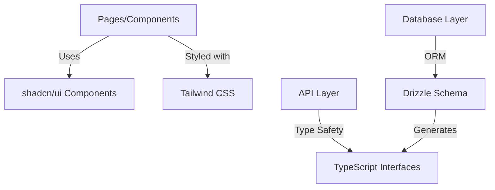
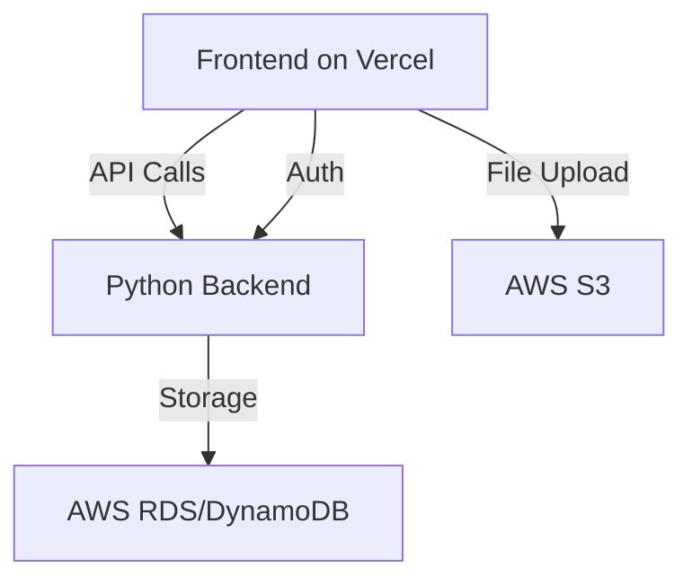
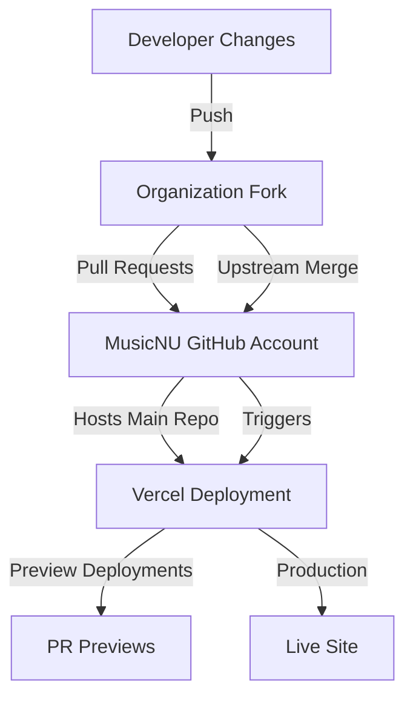

# Frontend Design Document

## Document Owners

- Frontend Lead: [Ethan Pineda](EthanPineda2025@u.northwestern.edu)
- UI/UX Designer: Everyone on MusicNU

## Document Status

As of November 4th : "Draft"

## Background

MusicNU is a web application targeting musicians who want to improve their playing skills through practice and feedback. Our users include:

1. Guitar/ukulele players seeking chord progressions and strumming patterns
2. Piano players looking to improvise and learn melodies
3. Music theory students practicing for exams
4. Drummers working on rhythm patterns

The primary problem we're solving is the lack of accessible, immediate feedback during music practice sessions. Currently, students must wait for instructor feedback or rely on self-assessment, which can reinforce incorrect practices.

## Requirements

### Functional Requirements

1. As a musician uploading content:

   - Given that I want to practice a specific piece
   - I need to upload sheet music in PDF/MusicXML format
   - So that I can receive feedback on my performance
   - Upload size limit: 10MB (based on common sheet music file sizes)

2. As a performing musician:

   - Given that I want to practice my instrument
   - I need to record my performance
   - So that I can receive feedback
   - Maximum recording length: 10 minutes (based on typical practice session duration)

3. As a student reviewing feedback:

   - Given that I want to improve my playing
   - I need to see detailed feedback about dynamics, rhythm, and pitch
   - So that I can focus on problem areas
   - Feedback latency < 5s (based on user attention span research)

4. As an anonymous user:
   - Given that I want to try the platform
   - I need to use core features without creating an account
   - So that I can evaluate the tool's usefulness
   - Session data retained for 24h (privacy consideration)

### Nonfunctional Requirements

1. Performance:

   - Initial page load < 2s (industry standard for web apps)
   - Time to interactive < 3s (prevents user abandonment)
   - Bundle size < 200KB (optimizes for various network conditions)

2. Reliability:

   - 99.9% uptime (GitHub Pages SLA)
   - Graceful degradation for older browsers
   - Offline feedback display for previously loaded content

3. Security:
   - CORS compliance
   - Content Security Policy implementation
   - Secure file upload handling

## Technology Stack

### Core Technologies

1. **TypeScript**

   - Strong type safety across the codebase
   - Enhanced developer experience
   - Better IDE support and autocompletion
   - Runtime error prevention
   - Improved code maintainability

2. **Drizzle ORM**

   - Type-safe database queries
   - Schema management
   - Migration handling
   - Benefits:
     - No manual type writing
     - Zero runtime overhead
     - SQL-like query builder
     - Easy integration with TypeScript

3. **Tailwind CSS**

   - Utility-first CSS framework
   - Zero runtime CSS-in-JS overhead
   - Consistent design system
   - Features utilized:
     - JIT compiler
     - Custom design tokens
     - Component variants
     - Responsive utilities

4. **shadcn/ui**
   - Accessible component primitives
   - Built on Radix UI
   - Tailwind CSS styling
   - Key components:
     - Form elements
     - Dialogs/Modals
     - Navigation
     - Feedback displays

### Architecture Patterns



### Integration Strategy

1. **Type Safety Pipeline**

   - TypeScript for frontend code
   - Drizzle for database schema
   - Generated types shared across layers
   - API interface definitions

2. **Styling Approach**

   - Tailwind for utility classes
   - shadcn/ui for base components
   - Custom components extend shadcn/ui
   - Consistent design tokens

3. **Component Architecture**
   - Atomic design principles
   - Composition over inheritance
   - Reusable primitives
   - Type-safe props

### Development Standards

1. **TypeScript Configuration**

   - Strict mode enabled
   - ESLint integration
   - Path aliases
   - Module resolution

2. **Database Patterns**

   - Drizzle schema definitions
   - Migration management
   - Type generation
   - Query optimization

3. **Styling Guidelines**

   - Tailwind class organization
   - Component variants
   - Responsive design
   - Theme customization

4. **Component Development**
   - Accessibility first
   - Performance optimization
   - Proper typing
   - Documentation

[Rest of document remains unchanged...]

## Feature List

| Priority Level | Feature Details              | ECD | PR Link | Owner |
| -------------- | ---------------------------- | --- | ------- | ----- |
| P0             | Sheet Music Upload Component | TBD | TBD     | Ethan |
| P0             | Audio Recording Interface    | TBD | TBD     | Ethan |
| P0             | Performance Feedback Display | TBD | TBD     | Ethan |
| P1             | User Progress Dashboard      | TBD | TBD     | Ethan |
| P1             | Practice Session Replay      | TBD | TBD     | Ethan |
| P2             | Advanced Analytics Display   | TBD | TBD     | Ethan |
| P5             | Social Sharing Features      | TBD | TBD     | Ethan |

## System Design

### Infrastructure Overview

MusicNU's architecture leverages AWS for core infrastructure while using Vercel for frontend deployment through a dedicated MusicNU GitHub account. This approach provides robust development features while maintaining cost-effectiveness.



## Deployment Strategy

### MusicNU GitHub + Vercel Approach

**Cost**: Free tier for personal accounts
**Pros**:

- Automatic preview deployments
- Built-in CI/CD
- SSL certificates included
- Proper environment management
- Native Next.js support
- Professional deployment URLs

Developer workflow for deploying code:



**Cons**:

- Requires management of separate GitHub account
- Need to maintain upstream sync process
- Organization members need proper access setup

**Why this fits our needs**:

- Takes advantage of Vercel's generous free tier
- Provides comprehensive deployment features
- Supports proper development workflow
- Scales with our project needs

### Development Workflow

1. All development happens in Northwestern organization fork
2. Pull requests trigger preview deployments
3. Merged PRs to MusicNU repo trigger production deployments
4. Automatic branch protection and review processes

**NOTE: this is a very hacky way of doing this... and it can work but it kind of depends if Vercel will continue to let this happen or not. I think for our use-case and current plan, this is highly doable. Since we're going to end managing our own infrastructure anyways, I feel like it makes since to just use the GitHub pages deployment since we could just write our own CI/CD pipelines to mimic the functionality of Vercel anyways**

### Infrastructure Components

1. **Frontend (Vercel)**

   - Next.js application
   - Authentication UI
   - Real-time feedback display
   - Practice session management

2. **Backend (AWS)**

   - Python API
   - Lucia Auth integration
   - Audio processing
   - Sheet music analysis

3. **Storage (AWS S3)**

   - User uploads
   - Sheet music files
   - Practice recordings
   - Generated feedback

4. **Database (AWS DynamoDB)**
   - User data
   - Practice sessions
   - Performance analytics
   - Auth sessions

## Authentication Strategy

### Lucia Auth Implementation

**Why Lucia**:

- Framework agnostic
- Integrates well with our Python backend
- Complete control over auth flow
- Stays within AWS ecosystem
- Cost-effective

### User Management

1. **Registration Flow**

   - Email/password signup
   - Account verification
   - Profile creation
   - Initial preferences

2. **Session Handling**

   - Secure session tokens
   - Refresh token rotation
   - Multi-device support
   - Session invalidation

3. **Security Measures**
   - Rate limiting
   - Password policies
   - Suspicious activity detection
   - Session management

### AWS Integration

- Single cloud provider for core services
- Unified monitoring
- Consistent security policies
- Simplified infrastructure management

## Security Considerations

1. **Authentication**

   - Secure password storage
   - Rate limiting on auth endpoints
   - Session management
   - Token security

2. **Data Protection**

   - CORS configuration
   - Content Security Policy
   - Secure file uploads
   - Data encryption

3. **Infrastructure**
   - AWS security best practices
   - Regular security audits
   - Access control
   - Monitoring and alerts

## Performance Optimization

1. **Frontend**

   - Vercel edge network
   - Asset optimization
   - Code splitting
   - Caching strategies

2. **API**

   - Response time optimization
   - Connection pooling
   - Query optimization
   - Cache implementation

3. **Storage**
   - S3 best practices
   - CDN integration
   - Upload optimization
   - Storage lifecycle policies

## Deployment Alternatives Considered

### 1. GitHub Pages (Selected Option)

**Cost**: Free
**Pros**:

- Zero hosting costs for static content
- Simple deployment process via GitHub Actions
- Excellent uptime (99.9%)
- Built-in CDN through GitHub's infrastructure
- Seamless integration with our existing GitHub workflow

**Cons**:

- Limited to static content
- No server-side rendering capabilities
- Manual SSL certificate management not possible

**Why this fits our needs**:

- Our Next.js app is primarily static, with dynamic content handled through API calls
- Backend services are Python-based and hosted separately
- CI/CD pipeline is straightforward with GitHub Actions
- Cost-effective for our current scale

### 2. Vercel

**Cost**: $20/month per developer in the Github Organization (would burn through Microgrant funds very quickly)
**Pros**:

- Native Next.js support
- Automatic CI/CD
- Serverless function deployment
- Edge network deployment
- Automatic SSL certificates

**Cons**:

- Could become costly at scale
- Serverless function capabilities redundant with our Python backend
- Lock-in to Vercel's ecosystem
- Unnecessary complexity for our static-first approach

### 3. AWS Amplify

**Cost**: Pay-as-you-go
**Pros**:

- Deep integration with AWS services
- Global CDN
- Built-in CI/CD
- Automatic SSL certificates

**Cons**:

- More complex configuration
- Higher learning curve
- Potential for unexpected costs
- Overkill for static content hosting

### 4. Traditional VPS (DigitalOcean/Linode)

**Cost**: Starting at ~$5/month
**Pros**:

- Full control over infrastructure
- Predictable pricing
- Flexibility in deployment options

**Cons**:

- Manual server management required
- Additional DevOps overhead
- No built-in CDN
- Higher maintenance burden

## Appendix

### API Interface

```typescript
interface APIClient {
  sheets: {
    upload: (file: File) => Promise<UploadResponse>;
    get: (id: string) => Promise<SheetMusic>;
  };
  recordings: {
    create: (data: RecordingData) => Promise<Recording>;
    getFeedback: (id: string) => Promise<Feedback>;
  };
}
```

### Performance Metrics

- First Contentful Paint: < 1.5s (first full page load)
- Time to Interactive: < 3s
- First Input Delay: < 100ms

### Security Considerations

- CORS configuration
- Content Security Policy
- File upload validation
- API rate limiting
